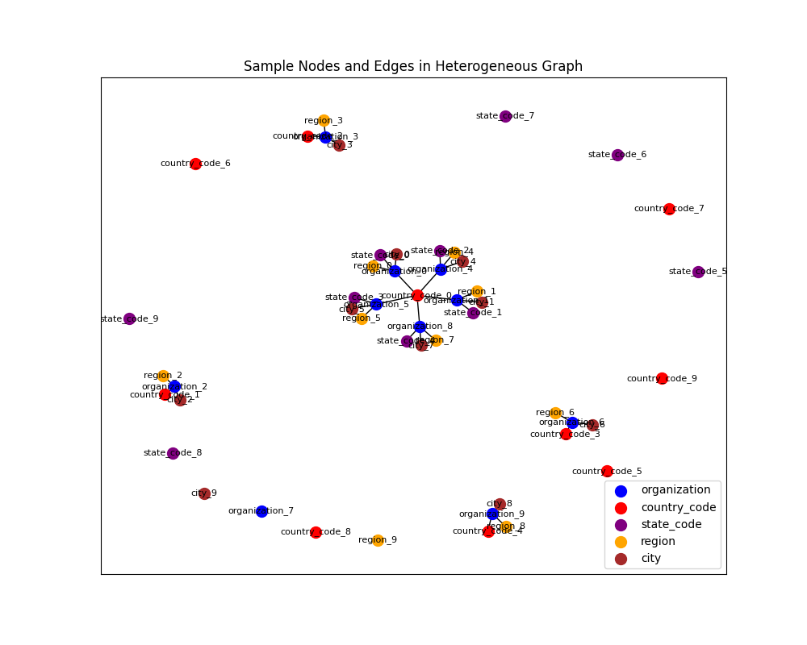
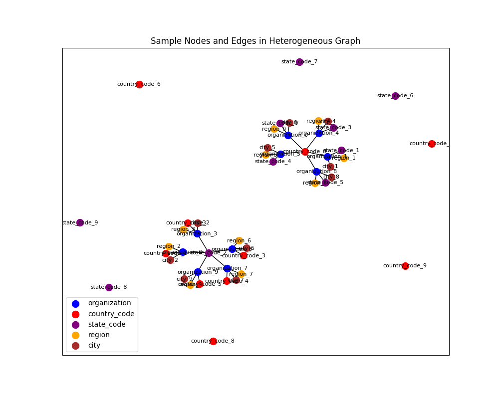

# A Trend-Aware Investment Target Recommendation System

This repository contains the implementation of the paper **"A Trend-Aware Investment Target Recommendation System with Heterogeneous Graph"**. It includes the preprocessing of investment data, trend extraction, preference propagation using graph neural networks, and scoring mechanisms for investment recommendations.

## Project Structure

- **`preprocessing.py`**: Handles data loading, description extraction, and heterogeneous graph creation.
- **`trend_extraction.py`**: Implements the trend extraction module based on historical investment sequences.
- **`preference_propagation.py`**: Defines the preference propagation using Relational Graph Convolutional Networks (RGCN).
- **`scoring.py`**: Combines trend embeddings and preference propagation to generate investment scores.
- **`main.py`**: The entry point for training the recommendation system.
- **`tests/test_preprocessing.py`**: Test file for verifying data preprocessing.

## Setup and Installation

Follow these steps to set up the environment and run the code:

1. **Create and Activate a Virtual Environment**
   ```bash
   python3 -m venv env
   source env/bin/activate
   ```

2. **Install Required Packages**
   ```bash
   pip install -r requirements.txt
   ```

## Running the Code

1. **Preprocessing the Data**
   Modify the `config` dictionary in `main.py` to specify paths to your raw and processed data files. Then, run:
   ```bash
   python main.py
   ```

2. **Testing the Preprocessing Module**
   To verify the preprocessing steps, run:
   ```bash
   python tests/test_preprocessing.py
   ```

## Results

The heterogeneous graph structure of the data is visualized below:

### Sample Nodes and Edges in the Heterogeneous Graph

#### Visualization 1


This image illustrates the connections between different node types in the heterogeneous graph. Nodes represent various entities like organizations, country codes, state codes, regions, and cities. The edges represent the relationships between these entities.

#### Visualization 2


This figure provides an additional perspective on the graph structure, showcasing the clustering and relational properties of nodes in the graph.

## Modules Overview

### 1. Data Preprocessing
This module processes raw investment data and generates description vectors for entities (organizations, brands, etc.) and a heterogeneous graph connecting these entities based on their relationships.

### 2. Trend Extraction
This module extracts macro trends from historical investment sequences by segmenting them into meaningful time intervals and aggregating segment-level information.

### 3. Preference Propagation
This module propagates latent preferences across a heterogeneous graph using Relational Graph Convolutional Networks (RGCN).

### 4. Scoring
The scoring module combines embeddings from trend extraction and preference propagation to generate final investment scores for recommendation.

## Dataset
The dataset used in this implementation is derived from a public data source. It includes:
- Organizations (investors)
- Brands (investment targets)
- Heterogeneous relationships (e.g., competitors, suppliers)

Please ensure that your dataset is formatted similarly for seamless integration.

## Citation
If you use this implementation in your research, please cite the original paper:

> Chen, M., Wang, C., Qin, C., Xu, T., Ma, J., Chen, E., & Xiong, H. (2021). A Trend-Aware Investment Target Recommendation System with Heterogeneous Graph. *IJCNN 2021.*

